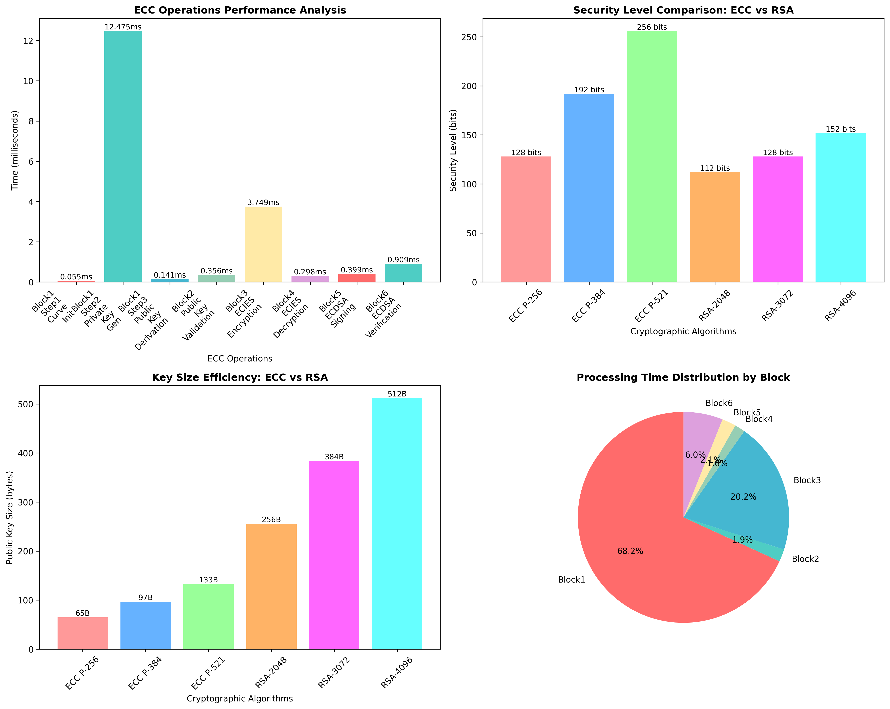

# 🔐 ECC vs RSA Cryptography Analysis

## 📊 Project Overview
This project presents a **comprehensive performance and security analysis of Elliptic Curve Cryptography (ECC)** compared with **RSA**.

The study evaluates:
- ⚡ Execution time of ECC operations  
- 🔒 Security strength comparison (ECC vs RSA)  
- 📦 Key size efficiency  
- 📈 Time distribution across cryptographic operations  

This project is useful for understanding why **ECC is preferred in modern secure systems**.

---

## 🖼️ Visualization Dashboard

---

## 🚀 Key Features

### ⚡ ECC Operations Performance
- Measures execution time (in ms) for:
  - Scalar Multiplication
  - Key Generation
  - Public Key Derivation
  - Key Validation
  - Encryption & Decryption
  - Signing & Verification

➡️ Insight: ECC operations are **fast and lightweight**, suitable for embedded systems.

---

### 🔒 Security Comparison (ECC vs RSA)
- ECC achieves **higher security with smaller key sizes**
- Comparison examples:
  - ECC-256 ≈ RSA-3072
  - ECC-384 ≈ RSA-7680 (approx equivalent)

➡️ Insight: ECC provides **stronger security per bit**

---

### 📦 Key Size Efficiency
- ECC keys are significantly smaller than RSA:
  - ECC-256 → 65 bytes
  - RSA-2048 → 256 bytes
  - RSA-4096 → 512 bytes

➡️ Insight: ECC reduces:
- Memory usage  
- Bandwidth  
- Computation cost  

---

### ⏱️ Time Distribution Analysis
- Shows how computation time is distributed across:
  - Key generation
  - Encryption/Decryption
  - Signing/Verification

➡️ Insight: Most time is spent in **key generation & encryption blocks**

---

## 🛠️ Technologies Used
- Python 🐍
- NumPy
- Matplotlib
- Seaborn

---

## 📂 Project Structure
ECC-Cryptography-Analysis/
│── ecc_analysis.py
│── ecc_comprehensive_analysis.png
│── dataset/ (optional)
│── README.md

## 📈 Key Insights

- ⚡ **ECC operations are faster than RSA**
- 🔒 **ECC provides equivalent security with much smaller keys**
- 📦 **ECC is memory-efficient and bandwidth-efficient**
- 🚀 **Ideal for:**
  - Mobile devices  
  - IoT systems  
  - Secure communication systems  

---

## 📌 Use Cases

- Secure communication systems  
- Blockchain & cryptocurrency  
- IoT security  
- Embedded systems  
- SSL/TLS encryption  

---

## 🔮 Future Improvements

- Implement hybrid ECC + AES encryption  
- Add real-time encryption benchmarking  
- Compare with post-quantum cryptography  
- Build web-based visualization dashboard  
